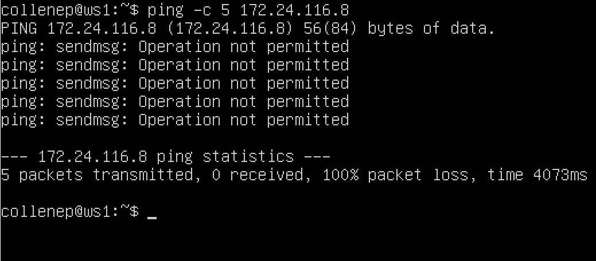
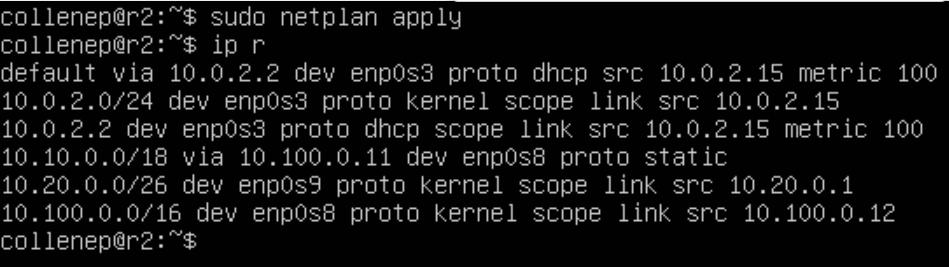
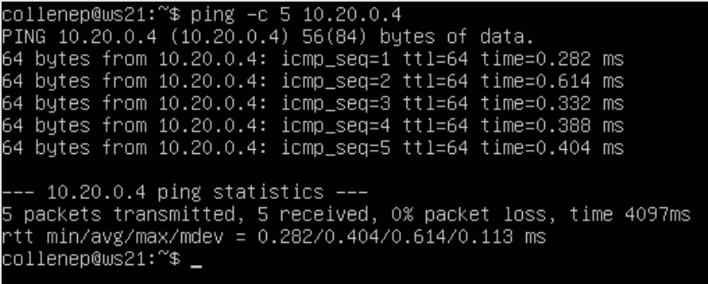
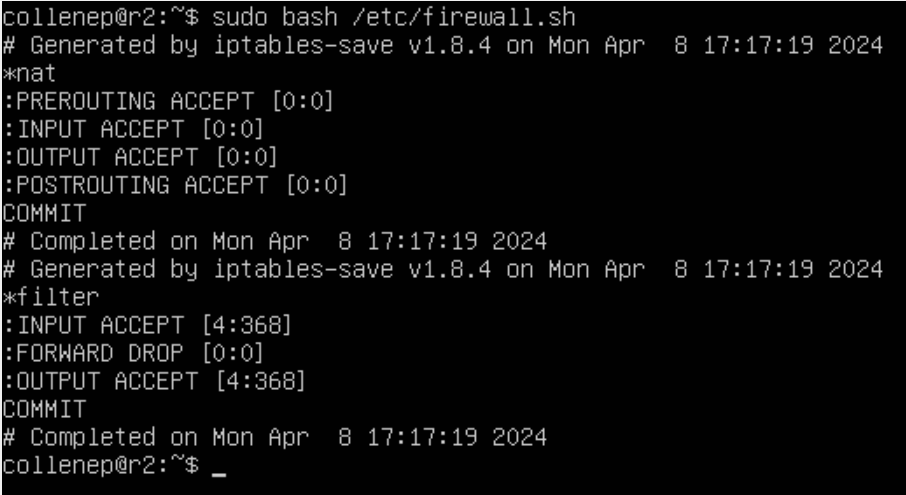
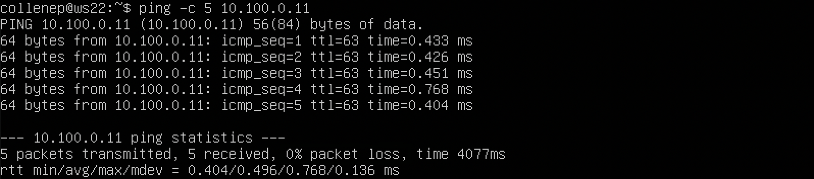

## Part 1. Инструмент ipcalc

Поднимаем виртуальную машину WS1.

### 1.1. Сети и маски

**1) Определить адрес сети 192.167.38.54/13**

Используя команду `ipcalc 192.167.38.54/13` определяем адрес сети: \

Адрес сети: `192.167.38.54`.

**2) Перевести маски 255.255.255.0 в префиксную и двоичную запись, /15 в обычную и двоичную, 11111111.11111111.11111111.11110000 в обычную и префиксную**

С помощью команды `ipcalc 192.167.38.54/255.255.255.0` определяем префиксную и двоичную запись: \

- Префиксная: `/24`
- Двоичная: `11111111.11111111.11111111. 000000000`

Благодаря команде `ipcalc 192.167.38.54/15` определяем обычную и двоичную запись: \

- Обычная: `255.254.0.0`
- Двоичная: `11111111.11111110.00000000. 000000000`

С помощью команды `ipcalc 192.167.38.54/11111111.11111111.11111111.11110000` определяем обычную и префиксную запись: \

Поскольку в `ipcalc` нельзя указывать маску в двоичном представлении, переводим число в обычное представление: \

- Обычная: `255.255.255.240`
- Префиксная: `28`

**3) Определить минимальный и максимальный хост в сети 12.167.38.4 при масках: /8, 11111111.11111111.00000000.00000000, 255.255.254.0 и /4**

Благодаря команде `ipcalc 12.167.38.4/8` находим минимальный и максимальный хост в сети: \

- Минимальный: `12.0.0.1`
- Максимальный: `12.255.255.254`

Преобразуем `11111111.11111111.00000000.00000000` в обыное представление. С помощью команды `12.167.38.4/255.255.0.0` находим минимальный и максимальный хост в сети: \

- Минимальный: `12.167.0.1`
- Максимальный: `12.167.255.254`

Благодаря команде `12.167.38.4/255.255.254.0` находим минимальный и максимальный хост в сети: \

- Минимальный: `12.167.38.1`
- Максимальный: `12.169.39.254`

С помощью команды `12.167.38.4/4` находим минимальный и максимальный хост в сети: \

- Минимальный: `0.0.0.1`
- Максимальный: `15.255.255.254`

### 1.2. localhost

**Определить и записать в отчёт, можно ли обратиться к приложению, работающему на localhost, со следующими IP: 194.34.23.100, 127.0.0.2, 127.1.0.1, 128.0.0.1**

Определяем, можно ли обратиться к приложению или нет, с помощью раздела `Hosts/Net`, в котором при возможности обращения будет выведено `Loopback`.

`ipcalc 194.34.23.100`: \

- Обратиться к приложению с IP `194.34.23.100` нельзя

`ipcalc 127.0.0.2`: \

- Обратиться к приложению с IP `127.0.0.2` можно

`ipcalc 127.1.0.1`: \

- Обратиться к приложению с IP `127.1.0.1` можно

`ipcalc 128.0.0.1`: \

- Обратиться к приложению с IP `128.0.0.1` нельзя

### 1.3. Диапазоны и сегменты сетей

**1) Какие из перечисленных IP можно использовать в качестве публичного, а какие только в качестве частных: 10.0.0.45, 134.43.0.2, 192.168.4.2, 172.20.250.4, 172.0.2.1, 192.172.0.1, 172.68.0.2, 172.16.255.255, 10.10.10.10, 192.169.168.1**

Определяем, какие IP можно использовать только в качестве частных, с помощью раздела `Hosts/Net`, в котором будет указано `Private Internrt`.

`ipcalc 10.0.0.45`: \

- Частный IP

`ipcalc 134.43.0.2`: \

- Публичный IP

`ipcalc 192.168.4.2`: \

- Частный IP

`ipcalc 172.20.250.4`: \

- Частный IP

`ipcalc 172.0.2.1`: \

- Публичный IP

`ipcalc 192.172.0.1`: \

- Публичный IP

`ipcalc 172.68.0.2`: \

- Публичный IP

`ipcalc 172.16.255.255`: \

- Частный IP

`ipcalc 10.10.10.10`: \

- Частный IP

`ipcalc 192.169.168.1`: \

- Публичный IP

**2) Какие из перечисленных IP адресов шлюза возможны у сети 10.10.0.0/18: 10.0.0.1, 10.10.0.2, 10.10.10.10, 10.10.100.1, 10.10.1.255**

Используя команду `ipcalc 10.10.0.0/18` выводим информацию об IP: \

Подходящие IP находятся в диапозоне от минимального IP хоста (`10.10.0.1`) до максимального (`10.10.63.254`).

- Возможные IP: `10.10.0.2`, `10.10.10.10`, `10.10.1.255`

## Part 2. Статическая маршрутизация между двумя машинами

Поднимаем 2-ую виртуальную машину WS2: \

В `VirtualBox` заходим в `Settings`, далее в `Network` и меняем режим адаптера на `Internal Network` у обеих машин: \

С помощью команды `ip a` смотрим существующие сетевые интерфейсы: \

**Опиши сетевой интерфейс, соответствующий внутренней сети, на обеих машинах и задать следующие адреса и маски: ws1 - 192.168.100.10, маска /16, ws2 - 172.24.116.8, маска /12.**

С помощью команды `netstat -nr` проверяем адреса машин: \

Открываем файл с помощью редактора nano командой `sudo nano /etc/netplan/00-installer-config.yaml` на каждой машине, отключаем `dhcp4` и указываем необходимые внутренние IP-адреса: \

Перезапускаем сервис сети командой `sudo netplan apply` на обоих машинах и проверяем новые IP-адреса командой `ip a`: \

### 2.1. Добавление статического маршрута вручную

**Добавь статический маршрут от одной машины до другой и обратно при помощи команды вида ip r add**

Добавляем статистический маршрут к `wm2` в `wm1` с помощью команды `sudo ip route add 172.24.116.8 dev enp0s3` и проверяем адреса машин командой `netstat -nr`: \

Добавляем статистический маршрут к `wm1` в `wm2` с помощью команды `sudo ip route add 192.168.100.10 dev enp0s3` и проверяем адреса машин командой `netstat -nr`: \

Пингуем соединение на `wm1` командой `ping -c 5 172.24.116.8`: \

Пингуем соединение на `wm2` командой `ping -c 5 192.168.100.10`: \

### 2.2. Добавление статического маршрута с сохранением

Перезапускаем машины командой `ip route`: \

Открываем конфигурационный файл для редактирования командой `sudo nano /etc/netplan/00-installer-config.yaml` и дописываем нужные строки: \

Применяем изменения командой `sudo netplan aplly`, после чего пингуем соединение между машинами: \

## Part 3. Утилита iperf3

### 3.1. Скорость соединения

**Переведи и запиши в отчёт: 8 Mbps в MB/s, 100 MB/s в Kbps, 1 Gbps в Mbps**

- 8 Mbps (мегабит в секунду) = 1 MB/s (мегабайт в секунду)
- 100 MB/s (мегабайт в секунду) = 819200 Kbps (килобит в секунду)
- 1 Gbps (гигабайт в секунду) = 1024 Mbps (мегабит в секунду)

### 3.2. Утилита iperf3

В `VirtualBox` заходим в `Settings`, далее в `Network`, меняем режим адаптера обратно на `NAT` и добавляем 2-ой адаптер `Internal Network` у обеих машин: \

Открываем конфигурационный файл для редактирования командой `sudo nano /etc/netplan/00-installer-config.yaml` и дописываем нужные строки: \

Принимаем изменения командой `sudo netplan apply` и выводим настройки интерфейсов командой `ip a` для проверки: \

Запускаем утилиту iperf3 на ws1 в режиме сервер командой `iperf -с`: \

После запускаем утилиту `iperf3` на `ws2` в режиме сервер командой `iperf -s`: \

Далее в выводе на `ws1` появится скорость обмена пакетов.

## Part 4. Сетевой экран

### 4.1. Утилита iptables

Создаем на `wm1` и `wm2` файлы, имитирующие `firewall`, командой `sudo touch /etc/firewall.sh`.

#### Нужно добавить в файл подряд следующие правила:

1) На `ws1` примени стратегию, когда в начале пишется запрещающее правило, а в конце пишется разрешающее правило (это касается пунктов 4 и 5).
2) На `ws2` примени стратегию, когда в начале пишется разрешающее правило, а в конце пишется запрещающее правило (это касается пунктов 4 и 5).
3) Открой на машинах доступ для порта `22` (ssh) и порта `80` (http).
4) Запрети `echo reply` (машина не должна «пинговаться», т.е. должна быть блокировка на OUTPUT).
5) Разреши echo reply (машина должна «пинговаться»). \

Запускаем файлы на обеих на обеих машинах с помощью команд `chmod +x /etc/firewall.sh` и `sudo bash /etc/firewall.sh`: \

Разница между стратегиями заключается в том, что `ws1` не сможет пропинговать `ws2`, поскольку очерёдность выполнения правил утилиты `iptables` производится сверху вниз. Поскольку запрет на вывод происходит первее, пингование прекращается. У `wm2` разрешается вывод первее, поэтому она может пропинговать `ws1`.

### 4.2. Утилита nmap

Пингуем машины: \

В файле `firewall.sh` для `ws1` первым было указано запрещающее правило, поэтому она не пингуется.

Используя команду `sudo nmap 172.24.116.8` на `ws1` проверяем, включен ли хост ws2 (должно вывестись `Host is up`): \

Видим, что хост включен.

Для сохранения дампов виртуальных машин открываем меню машин, заходим в `Snapshots`, нажимаем `Take` и добавляем дампы: \

## Part 5. Статическая маршрутизация сети

Необходимо создать сеть по этой схеме: \

Поднимаем 5 машин. Создаем машину r1, после чего клонируем её 4 раза и меняем имена хостов командой `sudo hostnamectl set-hostname new_hostname` на соответствующие названия: `r1`, `r2`, `w11`, `w21`, `w22`.

Для машин `r1` и `r2` в VirtualBox заходим в Settings, далее в Network и включаем два адаптера Internal Network, присваивая имена определенным образом: \

Для машин `w11`, `w21` и `w22` в VirtualBox заходим в Settings, далее в Network и включаем 2-ой адаптер Internal Network, присваивая имена определенным образом: \

Проверяем интерфейсы на всех машинах командой `ip a`.

### 5.1. Настройка адресов машин

Редактируем конфигурационные netplan-файлы благодаря команде `sudo nano /etc/netplan/00-00-installer-config.yaml` и дописываем нужные строки:

`r1`: \

`r2`: \

`w11`: \

`w21`: \

`w22`: \

Принимаем изменения командой `netplan apply` и проверяем их на корректность командой `ip -4 a`: \

Пингуем `ws22` c `ws21` командой `ping -c 5 10.20.0.20`: \

Также пингуем `r1` с `ws11` командой `ping -c 4 10.10.0.2`: \

### 5.2. Включение переадресации IP-адресов

Выполняем команду `sudo sysctl -w net.ipv4.ip_forward=1` на роутерах `r1` и `r2` для включения переадремации IP: \

Однако в таком случае после перезагрузки переадресация не будет работать. Открываем для редактирования `sysctl`-конфиг командой `sudo nano /etc/sysctl.conf` и раскомменчиваем строку `net.ipv4.ip_forward = 1`: \

### 5.3. Установка маршрута по-умолчанию

Настраиваем маршрут по-умолчанию (шлюз) для рабочих станций `ws11`, `ws21` и `ws22`. Открываем для редактирования `netplan`-конфиг у каждой машины командой `sudo nano /etc/netplan/00-installer-config.yaml` и дописываем недостающие строки: \

Принимаем изменения командой `sudo netplan apply` и проверяем маршрут командой `ip r`: \

С помощью команды `tcpdump -tn -i enp0s8` на роутере `r2` выводим отправляемые ему пакеты. Пингуем `r2` с машины `ws11`: \

Наблюдаем, что `r1` получает пакеты, но не может отправить их обратно, поскольку не имеет маршрута.  

### 5.4. Добавление статических маршрутов

Добавляем в роутеры `r1` и `r2` статические маршруты, путем редактирования netplan-конфига командой `sudo nano /etc/netplan/00-installer-config.yaml`.
`r1`: \

`r2`: \

Принимаем изменения командой `sudo netplan apply` и проверяем маршрут командой `ip r` (строка оканчивается на `proro static`): \

**Запусти команды на ws11: `ip r list 10.10.0.0/[маска сети]` и `ip r list 0.0.0.0/0`**

На `ws11` вводим команды `ip r list 10.10.0.0/18` и `ip r list 0.0.0.0/0`: \

Для адреса `10.10.0.0/18` был выбран маршрут, отличный от `0.0.0.0/0` (он попадает под маршрут по-умолчанию), т.к. машина `ws11` соединена с сетью `10.10.0.0/18` по своему IP-адресу `10.10.0.2`, для других адресов используется маршрут по умолчанию, который указан в файле `10.10.0.1`.

### 5.5. Построение списка маршрутизаторов

Запускаем на `r1` команду дампа: `tcpdump -tnv -i enp0s8` (вывод можно увидеть ниже).

Используемые флаги:
- `-n` - не конвертировать адреса в имена;
- `-t` - не выводить время при выводе каждой строкчи дампа;
- `-v` - выводить более подробную информацию.

При помощи утилиты `traceroute` строим список маршрутизаторов на пути от `ws11` до `ws21`, используя команду `traceroute 10.20.0.10` на `ws11`: \

Далее в выводе команды `tcpdump -tnv -i enp0s8` на машине `r1` построится список маршрутизаторов: \

- Каждый пакет проходит на своем пути определенное количество узлов, пока достигнет своей цели. Причем, каждый пакет имеет свое время жизни. Это количество узлов, которые может пройти пакет перед тем, как он будет уничтожен. Этот параметр записывается в заголовке `TTL`, каждый маршрутизатор, через который будет проходить пакет уменьшает его на единицу. При `TTL=0` пакет уничтожается, а отправителю отсылается сообщение `Time Exceeded`.
- Команда `traceroute` в `linux` использует `UDP` пакеты. Она отправляет пакет с `TTL=1` и смотрит адрес ответившего узла, дальше `TTL=2`, `TTL=3` и так пока не достигнет цели. Каждый раз отправляется по три пакета и для каждого из них измеряется время прохождения. Пакет отправляется на случайный порт, который, скорее всего, не занят. Когда утилита `traceroute` получает сообщение от целевого узла о том, что порт недоступен трассировка считается завершенной.

### 5.6. Использование протокола ICMP при маршрутизации

Запускаем на `r1` перехват сетевого трафика, проходящего через `enp0s8` с помощью команды `sudo tcpdump -n -i enp0s8 icmp` (изображение вывода будет ниже).

Пингуем несуществующий адрес на `ws11` командой `sudo ping -c 5 10.105.3.111`: \

В итоге в выводе `r1` увидим это: \

Сохраняем дампы образов виртуальных машин (как в part 4.2): \

## Part 6. Динамическая настройка IP с помощью DHCP

**1) Укажи адрес маршрутизатора по-умолчанию, `DNS`-сервер и адрес внутренней сети**

Для маршрутизатора `r2` открываем для редактирования `DHCP`-конфиг командой `sudo nano /etc/dhcp/dhcpd.conf` и указываем адрес маршрутизатора по-умолчанию, DNS-сервер и адрес внутренней сети (дописываем строки): \

**2) В файле `resolv.conf` пропиши nameserver `8.8.8.8`**

На роутере `r2` открываем конфиг `/etc/resolv.conf` для редактирования командой `sudo nano /etc/resolv.conf` и редактируем строки: \

**3) Перезагрузи службу `DHCP` командой `systemctl restart isc-dhcp-server`. Машину `ws21` перезагрузи при помощи reboot и через ip a покажи, что она получила адрес. Также пропингуй `ws22` с `ws21`**

Перезагружаем службу `DHCP` командой `systemctl restart isc-dhcp-server`: \

Открываем для редактирования `netplan`-конфиг командой `sudo nano /etc/netplan/00-installer-config.yaml`на машинах `ws21` и `ws22`, после чего принимаем изменения командой `sudo netplan apply` :\

Перезагружаем `ws21` командой `sudo systemctl reboot`.

Проверяем присвоенные адреса устройств: \

Пингуем `ws22` с `ws21` для проверки: \

**4) Укажи `MAC` адрес у `ws11`, для этого в `etc/netplan/00-installer-config.yaml` надо добавить строки: `macaddress: 10:10:10:10:10:BA`, `dhcp4: true`**

На машине `ws11` открываем `netplan`-конфиг для редактирования командой `sudo nano /etc/netplan/00-installer-config.yaml`, редактируем строки и применяем изменения командой `sudo netplan apply`: \

Выключаем машину `ws11`.

В `VitualBox` заходим в `Settings`, далее в `Network` и для 2-ого адаптера указываем `MAC`-адрес: \

**5) Для r1 настрой аналогично r2, но сделай выдачу адресов с жесткой привязкой к MAC-адресу (ws11). Проведи аналогичные тесты**

На роутере `r1` открываем для редактирования `DHCP`-конфиг командой `sudo nano /etc/dhcp/dhcpd.conf` и настраиваем как `r2`, но но выдачу адресов сделаем с жесткой привязкой к `ws11`: \

На роутере `r1` открываем конфиг `/etc/resolv.conf` для редактирования командой `sudo nano /etc/resolv.conf` и редактируем строки: \

Перезагружаем службу `DHCP` командой `systemctl restart isc-dhcp-server`: \

На `ws11` проверяем новый IP командой `ip a`: \

Пингуем соединение `ws22` на `ws21` с помощью команды `ping -c 5 10.10.0.4`: \

**6) Запроси с ws21 обновление ip адреса**

Проверяем `IP` до обновления командой `ip a`: \

Командой `sudo dhclient -v` запрашиваем обновление `IP` у `DHCP`: \

- `-v` - выведение дополнительной информации

Перепроверяем `IP` командой `ip a`: \

Удаляем старый `IP` командой `sudo dhclient -r`: \

- `-r` - явно освобождает текущую аренду ip адреса

В части 6 были использованы следующие опции `DHCP`-протокола:
- option routers `ip-address [, ip-address...];` - адреса шлюзов для клиентской сети. Маршрутизаторы должны быть перечислены в порядке предпочтительности.
- option domain-name-servers `ip-address [, ip-address...];` - Список DNS серверов доступных клиенту. Сервера должны быть перечислены в порядке предпочтительности.

Сохраняем дампы образов виртуальных машин: \

## Part 7. NAT

**В файле /etc/apache2/ports.conf на ws22 и r1 измени строку Listen 80 на Listen 0.0.0.0:80, то есть сделай сервер Apache2 общедоступным**

На `ws22` и `r2` открываем конфиг для редактирования командой `sudo nano /etc/apache2/ports.conf` и дописываем нужные строки.

`r2`: \

`ws22`: \

**Запусти веб-сервер Apache командой service apache2 start на ws22 и r1**

На `ws22` и `r1` Запускаем веб-сервер `Apache` командой `service apache2 start`: \

**Добавь в фаервол, созданный по аналогии с фаерволом из Части 4, на `r2` следующие правила:**
**1) Удаление правил в таблице `filter` - `iptables -F;`**
**2) Удаление правил в таблице "NAT" - `iptables -F -t nat;`**
**3) Отбрасывать все маршрутизируемые пакеты - `iptables --policy FORWARD DROP`.**

Создаем и открываем файл для редактирования на `r2` командой `sudo nano /etc/firewall.sh` и вписываем нужные строки: \

Запускаем файл командами `sudo chmod +x /etc/firewall.sh` и `sudo bash /etc/firewall.sh: \

При запуске файла `firewall.sh` с этими правилами, `ws22` не должна "пинговаться" с `r1`: \

**Добавь в файл ещё одно правило:**
**4) Разрешить маршрутизацию всех пакетов протокола `ICMP`**

Прописываем правило для протокола `icmp` и цепочки `FORWARD` в `r2`. Открываем файл для редактирования командой `sudo nano /etc/firewall.sh` и вписываем нужные строки: \

Запускаем файл командами `sudo chmod +x /etc/firewall.sh` и `sudo bash /etc/firewall.sh: \

Теперь при запуске файла `firewall.sh` с этими правилами, `ws22` должна "пинговаться" с `r1`.

Проверяем соединение между `r1` и `ws22`: \

**Добавь в файл ещё два правила:**
**5) Включи `SNAT`, а именно маскирование всех локальных `ip` из локальной сети, находящейся за `r2` (по обозначениям из Части 5 - сеть 10.20.0.0)**
**6) Включи `DNAT` на `8080` порт машины `r2` и добавить к веб-серверу `Apache`, запущенному на `ws22`, доступ извне сети**

На роутере `r2` открываем `firewall.sh` для редактирования командой `sudo nano /etc/firewall.sh` и вписываем нужные строки: \

Используемые опции:
- `-t` - указывает на используемую таблицу;
- `-p` - указывает протокол, такие как tcp, udp, udplite и другие, поддерживаемые системой, ознакомиться со списком можно в файле `/etc/protocols`;
- `-m` - подключает указанный модуль;
- `-s` - указывает адрес источника пакета, в качестве значения можно указать как один IP-адрес, так и диапазон;
- `-i` - задает входящий сетевой интерфейс;
- `-o` - указывает исходящий сетевой интерфейс;
- `--dport` - порт получателя пакета;
- `DNAT` — подменяет адрес получателя в заголовке `IP`-пакета, основное применение — предоставление доступа к сервисам снаружи, находящимся внутри сети;
- `SNAT` — служит для преобразования сетевых адресов, применимо, когда за сервером находятся машины, которым необходимо предоставить доступ в Интернет, при этом от провайдера имеется статический IP-адрес.

Запускаем файл также, как в Части 4. Перед тестированием отключаем сетевой интерфейс `NAT` в VirtualBox: \

Проверяем соединение по `TCP` для `SNAT`, для этого с `ws22` подключаемся к серверу `Apache` на `r1` командой `telnet 10.100.0.11 80`: \

Проверить подмену `IP`-адреса можно с помощью команды `tcpdump` - пингуем с машины `ws22` роутер `r1`, в выводе `tcpdump` будет отображаться с какого адреса идет запрос - `IP`-адрес `r2`: \

Проверяем соединение по `TCP` для `DNAT`. Для этого с `r1` подключаемся к серверу `Apache` на `ws22` (обращаемся по адресу `r2` и порту `8080`): \

Для этой проверки отключаем на `ws22` автоматическую выдачу `ip` командой `sudo tcpdump -i enp0s8`: \

Сохраняем дампы в `VirtualBox`: \

## Part 8. Дополнительно. Знакомство с SSH Tunnels

На `r2` запускаем `firewall.sh` командами `sudo chmod +x /etc/firewall.sh` и `sudo bash /etc/firewall.sh`: \

Запускаем `Apache` на `ws22`. В конфиге `/etc/apache2/ports.conf` меняем строку `Listen 80` на `Listen localhost:80`: \

Используем `Local TCP forwarding` с `ws21` до `ws22`, чтобы получить доступ к веб-серверу на `ws22` с `ws21`: \

Используем `Remote TCP forwarding` c `ws11` до `ws22`, чтобы получить доступ к веб-серверу на `ws22` с `ws11`: \

Проверяем, сработало ли подключение. Переходим во 2-ой терминал (в терминале машины `ws11` нажимаем `Alt` + `F2`) и выполяем команду `telnet 127.0.0.1 8080`. В момент выполнения данной команды нажимаем любую клавишу: \

Сохраняем дампы образов виртуальных маштн в `VirtualBox`: \

